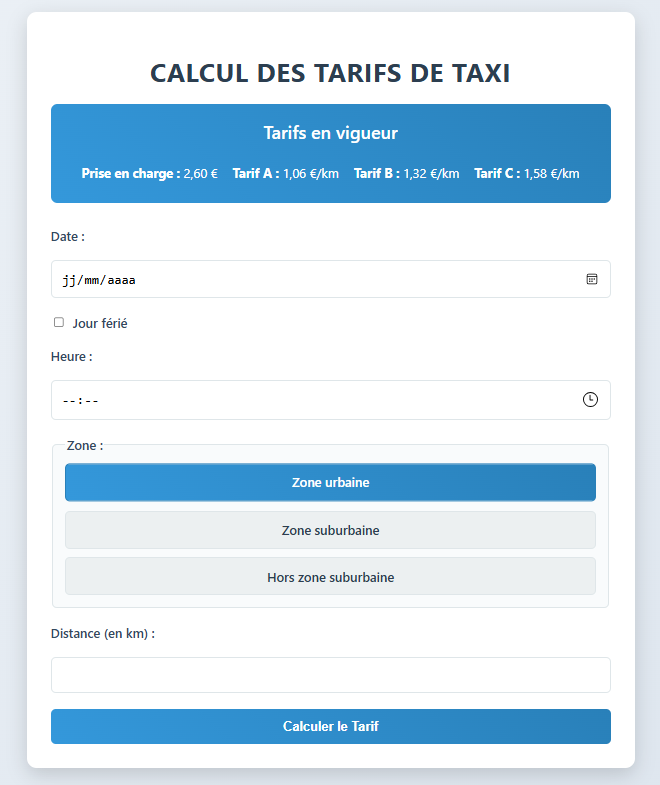

# Calculateur tarifs taxis

Vous intervenez sur le développement d'une application dédiées aux chauffeurs de taxis.

L'objectif est de livrer une application PHP qui permet aux utilisateurs de faire une estimation du tarif d'une course en fonction de critères qu'ils pourront saisir via un formulaire.

Voici un apperçu de l'interface graphique :



> [!NOTE]  
> L'application n'est pas encore pleinement fonctionnelle.
>
> Ce dépôt contient le code à compléter afin d'implémenter la méthode de calcul.
>
> Lisez la suite de ce `README.md` pour en apprendre plus.

## Règles tarifaires

3 tarifs au kilomètres sont applicables :
- Tarif A (1,06 €/km) ;
- Tarif B (1,32 €/km) ;
- Tarif C (1,58 €/km).

De plus, 3 zones peuvent être desservies par les chaffeurs :
- Zone urbaine ;
- Zone suburbaine ;
- Hors zone suburbaine.

Le tableau suivant récapitule les différentes règles tarifaires :

|  | Tarif A (1,06 €/km) | Tarif B (1,32 €/km) | Tarif C (1,58 €/km) |
|--------------|---------------------|---------------------|---------------------|
| **Zone urbaine** | Lundi au Samedi : 10h00 - 17h00 | Lundi au Samedi : 17h00 - 10h00<br>Dimanche : 07h00 - 00h00<br>Jours fériés : 00h00 - 24h00 | Dimanche (y compris fériés) : 00h00 - 07h00 |
| **Zone suburbaine** | - | Lundi au Samedi : 07h00 - 19h00 | Lundi au Samedi : 19h00 - 07h00<br>Dimanche (y compris fériés) : 00h00 - 24h00 |
| **Hors zone** | - | - | Toute heure, tous les jours |

**Note** : La prise en charge est de **2,60 €** pour toutes les courses, quelle que soit la zone ou le tarif appliqué.

## Démarrer le projet

1. Récupérer les dépendance du projet grâce à composer :
```bash
composer install
```

2. Démarrer le projet en utilisant le serveur de développement de php :
```sh
php -S localhost:8000 -t public
```

`public` indique le dossier dans lequel est situé le fichier `index.php`.

## Travail à effectuer

Implémentez la fonction `calculateFare(int $jourSemaine, int $hour, string $zone, float $distance, bool $estFerie): float` du fichier `TaxiFareCalculatorTest.php`.

Pour vous aider un fichier de test `TaxiFareCalculatorTest.php` est disponible pour vous aiguiller sur les développements.

## Compétence abordées

Algorithmique :
- utilisation de structures de contrôle conditionnelles

Développement PHP :
- récupération de variables via un formulaire
- traitement des données